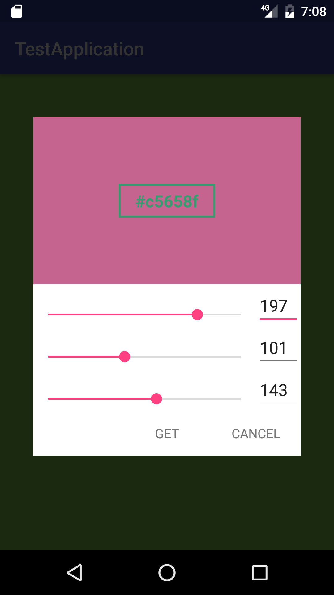

Color Picker Dialog
===================
Color picker dialog for android

Download
--------
Download Gradle:
<pre>
	<code>dependencies {
		compile 'dev.duck:color-picker-dialog:0.1.5'
	}</code>
</pre>

Usage Example
-------------
	ColorPickerDialog dialog = new ColorPickerDialog.Builder(this)
        .positiveButton("OK")
        .negativeButton("CANCEL")
        .positiveButtonClickListener(new OnPositiveButtonClickListener() {
          @Override
          public void onClick(View view) {
            background.setBackgroundColor(Color.parseColor(dialog.getColor()));
          }
        })
        .build();
    dialog.show();

Usage Image
-----------

